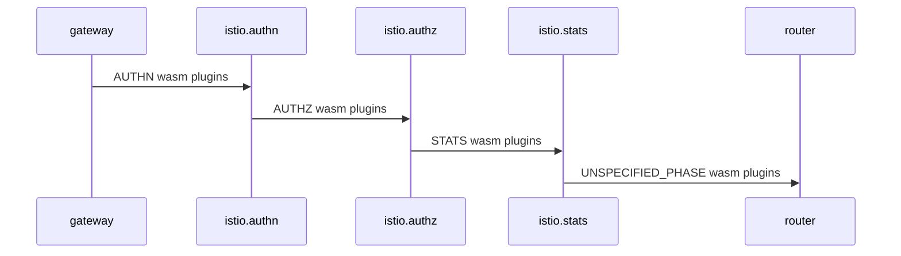

# Istio与WebAssembly

Istio引入了WebAssembly扩展的概念，它允许开发者通过将自定义的WebAssembly模块插入Istio的Envoy代理来扩展Istio的功能。这样，开发者可以在Istio代理中运行自己的逻辑，并且可以通过WebAssembly模块来修改和定制网络请求、响应以及流量控制。这为Istio带来了更高的灵活性和可扩展性，允许开发者在不改变Istio核心代码的情况下添加自定义功能。

WebAssembly在Istio中的应用场景包括但不限于：

- 自定义流量管理：开发者可以使用WebAssembly模块来实现自定义的流量控制策略，如AB测试、灰度发布等。
- 安全策略：通过WebAssembly模块，可以实现自定义的安全策略，例如访问控制、防火墙规则等。
- 日志和监控：开发者可以使用WebAssembly模块来收集特定流量的指标或日志。

## ABI 规范定义 (Application Binary Interface)

应用程序二进制接口（ABI）的规范，定义在L4/L7代理（和/或其他主机环境）与作为WebAssembly模块交付的扩展之间使用的约定。

这些基于事件驱动的流式API和便捷的实用函数最初是为WebAssembly在Envoy项目中开发的，但它们与代理无关，使用者可以在不同的代理之间使用相同的Proxy-Wasm扩展。

### SDKs

- [C++ SDK](https://github.com/proxy-wasm/proxy-wasm-cpp-sdk)
- [Rust SDK](https://github.com/proxy-wasm/proxy-wasm-rust-sdk)
- [AssemblyScript SDK](https://github.com/solo-io/proxy-runtime)
- [TinyGo SDK](https://github.com/tetratelabs/proxy-wasm-go-sdk)

## Istio Wasm Plugin 介绍

[WasmPlugins](https://istio.io/latest/zh/docs/reference/config/proxy_extensions/wasm-plugin/)提供了一种通过WebAssembly过滤器来扩展Istio代理功能的机制。

执行顺序（作为Envoy的过滤器链的一部分）由阶段（phase）和优先级（priority）设置确定，允许在用户提供的WasmPlugins和Istio内部过滤器之间配置复杂的交互。

下面我们简单举个例子说明一下这个插件如何使用：

> 入口网关的AuthN过滤器实现了OpenID流程

- 示例一：使用本地文件读取wasm插件

```yaml
apiVersion: extensions.istio.io/v1alpha1
kind: WasmPlugin
metadata:
  name: openid-connect
  namespace: istio-ingress
spec:
  selector:
    matchLabels:
      istio: ingressgateway
  url: file:///opt/filters/openid.wasm
  sha256: 1ef0c9a92b0420cf25f7fe5d481b231464bc88f486ca3b9c83ed5cc21d2f6210
  phase: AUTHN
  pluginConfig:
    openid_server: authn
    openid_realm: ingress

```

- 示例二：使用OCI镜像读取wasm插件并设置拉取的secret

```yaml
apiVersion: extensions.istio.io/v1alpha1
kind: WasmPlugin
metadata:
  name: openid-connect
  namespace: istio-ingress
spec:
  selector:
    matchLabels:
      istio: ingressgateway
  url: oci://private-registry:5000/openid-connect/openid:latest
  imagePullPolicy: IfNotPresent
  imagePullSecret: private-registry-pull-secret
  phase: AUTHN
  pluginConfig:
    openid_server: authn
    openid_realm: ingress

```

- 示例三：使用环境变量读取变量

```yaml
apiVersion: extensions.istio.io/v1alpha1
kind: WasmPlugin
metadata:
  name: openid-connect
  namespace: istio-ingress
spec:
  selector:
    matchLabels:
      istio: ingressgateway
  url: oci://private-registry:5000/openid-connect/openid:latest
  imagePullPolicy: IfNotPresent
  imagePullSecret: private-registry-pull-secret
  phase: AUTHN
  pluginConfig:
    openid_server: authn
    openid_realm: ingress
  vmConfig:
    env:
    - name: POD_NAME
      valueFrom: HOST
    - name: TRUST_DOMAIN
      value: "cluster.local"

```

- 示例四： 使用http读取wasm插件

```yaml
apiVersion: extensions.istio.io/v1alpha1
kind: WasmPlugin
metadata:
  name: openid-connect
  namespace: istio-ingress
spec:
  selector:
    matchLabels:
      istio: ingressgateway
  url: https://private-bucket/filters/openid.wasm
  imagePullPolicy: Always
  phase: AUTHN
  pluginConfig:
    openid_server: authn
    openid_realm: ingress
  vmConfig:
    env:
    - name: POD_NAME
      valueFrom: HOST
    - name: TRUST_DOMAIN
      value: "cluster.local"
```

### Wasm Plugin 与 Istio执行顺序


在Istio中，Wasm插件（WasmPlugins）通过定义phase和priority来控制其在Istio代理中的执行顺序。这些参数决定了Wasm插件在代理的过滤器链中的位置，从而影响它们在请求处理过程中的顺序和优先级。

1. Phase（阶段）：
   Phase定义了Wasm插件在Envoy代理的过滤器链中的位置。Istio支持以下几个阶段：
   - AUTHN（Authentication）：在Istio的认证（Authentication）过滤器之前执行。通常用于在请求进入Istio代理之前执行身份验证逻辑。
   - AUTHZ（Authorization）：在Istio的授权（Authorization）过滤器之前执行。通常用于在请求进入Istio代理之前执行访问控制逻辑。
   - STATS：在Istio的统计（Statistics）过滤器之前执行。通常用于在统计请求信息之前执行某些操作。

2. Priority（优先级）：
   Priority定义了在同一阶段中多个Wasm插件之间的执行顺序。在同一个阶段中，多个Wasm插件可以按照优先级的值进行排序，从而确保它们在执行时的先后顺序。优先级值越高的插件将在优先级值较低的插件之前执行。

当Istio代理收到请求时，它会根据Wasm插件的phase和priority设置，将Wasm插件按照阶段进行分组，并在每个阶段内按照优先级值进行排序。然后，Istio代理将按照阶段和优先级的顺序依次调用每个Wasm插件的逻辑。这样，Wasm插件可以在请求的不同阶段介入，并按照需要进行自定义处理，比如进行认证、授权、统计等操作。

总结起来，Istio中的Wasm插件通过定义phase和priority来控制其在代理的过滤器链中的执行位置和顺序。这为开发者提供了灵活的方式来扩展和定制Istio的功能，并允许在请求的不同阶段对流量进行个性化处理。

### WasmPlugin 支持字段

`WasmPlugins`提供了一种通过WebAssembly过滤器扩展Istio代理功能的机制。以下是`WasmPlugins`支持的字段以及它们的描述：

- `selector`: 用于选择将应用该插件配置的特定pod/虚拟机集合的条件。如果省略此配置，则该插件将应用于同一命名空间中的所有工作负载实例。如果WasmPlugin存在于配置的根命名空间中，则将应用于任何命名空间中的适用工作负载。不是必需字段。
- `url`: Wasm模块或OCI容器的URL。如果未提供协议（scheme），默认为oci://，引用OCI镜像。其他有效的协议有file://，用于引用在代理容器中本地存在的.wasm模块文件，以及http[s]://，用于引用远程托管的.wasm模块文件。不是必需字段。
- `sha256`: SHA256校验和，用于验证Wasm模块或OCI容器。如果url字段已经使用@sha256:表示法引用了SHA256值，它必须与此字段的值匹配。如果引用的是OCI镜像，并且设置了该字段，则在拉取后将验证其校验和与此字段的内容是否匹配。不是必需字段。
- `imagePullPolicy`: 在通过OCI镜像或http/https获取Wasm模块时应用的拉取行为。仅在引用没有摘要的Wasm模块时（包括在OCI镜像URL中没有摘要或在vm_config的sha256字段中没有摘要时）相关。默认为IfNotPresent，除非在URL中引用了OCI镜像且使用了最新标签（latest tag），此时默认为Always，与K8s行为相同。不是必需字段。
- `imagePullSecret`: 用于OCI镜像拉取的凭据。指定K8s Secret的名称，该Secret位于与WasmPlugin相同的命名空间中，其中包含用于在拉取镜像时进行身份验证的Docker拉取凭据。不是必需字段。
- `pluginConfig`: 传递给插件的配置信息。不是必需字段。
- `pluginName`: 在Envoy配置中使用的插件名称（之前称为rootID）。某些.wasm模块可能需要此值来选择要执行的Wasm插件。不是必需字段。
- `phase`: 确定将WasmPlugin插入过滤器链的位置。不是必需字段。
- `priority`: 确定在同一阶段中多个WasmPlugin的执行顺序。当多个WasmPlugin应用于同一工作负载的同一阶段时，它们将按照优先级的值降序应用。如果未设置优先级，或者存在两个WasmPlugin具有相同的值，则执行顺序将根据WasmPlugin的名称和命名空间来决定。默认值为0。不是必需字段。
- `vmConfig`: 配置Wasm虚拟机（VM）的信息。更多细节可以在其他地方找到。不是必需字段。
- `match`: 用于指定哪些流量将传递给WasmPlugin的条件。如果满足任何TrafficSelectors中的条件，则流量将传递给WasmPlugin。不是必需字段。

注意：以上字段描述了WasmPlugins的配置参数，可以根据需求选择性地配置来实现对Istio代理的扩展功能。

## 环境准备

```shell
wget https://github.com/labring/sealos/releases/download/v4.3.0/sealos_4.3.0_linux_amd64.tar.gz
tar -zxvf sealos_4.3.0_linux_amd64.tar.gz sealos
chmod a+x sealos 
mv sealos /usr/bin/
sealos run labring/kubernetes-docker:v1.23.0 labring/helm:v3.12.0 labring/calico:v3.24.1
```

### 部署 Istio

```shell
sealos run labring/istio:1.16.2-min
```

### 安装rust语言环境

```shell
curl --proto '=https' --tlsv1.2 -sSf https://sh.rustup.rs | sh
```

> 如果使用的国内环境，可以使用以下命令操作

```shell
export RUSTUP_DIST_SERVER="https://rsproxy.cn"
export RUSTUP_UPDATE_ROOT="https://rsproxy.cn/rustup"
curl --proto '=https' --tlsv1.2 -sSf https://rsproxy.cn/rustup-init.sh | sh
cat > ~/.cargo/config <<EOF
[source.crates-io]
replace-with = 'rsproxy-sparse'
[source.rsproxy]
registry = "https://rsproxy.cn/crates.io-index"
[source.rsproxy-sparse]
registry = "sparse+https://rsproxy.cn/index/"
[registries.rsproxy]
index = "https://rsproxy.cn/crates.io-index"
[net]
git-fetch-with-cli = true
EOF
```

### 初始化 rust wasm 项目

#### 使用 JetBrains 插件

打开Goland 并安装插件 Rust后创建项目

1. 新增配置istio-wasm-rust模板: 
> 填写模板地址: https://github.com/labring-actions/istio-wasm-template.git


2. 新建项目选择istio-wasm-rust模板


#### 使用命令行

```shell
cargo install cargo-generate
cargo generate --git https://github.com/labring-actions/istio-wasm-template.git --name my-project
cd my-project
```


### 编译

本地编译：

```shell
make build 
```

容器编译:
```shell
REPO=sealos.hub:5000 IMG=wasm/wasm-auth:latest make docker-build
```

### 部署

#### 本地编译后部署

```shell
sealos login sealos.hub:5000
REPO=sealos.hub:5000 IMG=wasm/wasm-auth:v1 make oci-build
REPO=sealos.hub:5000 IMG=wasm/wasm-auth:latest make sealos-push
sealos run sealos.hub:5000/wasm/wasm-auth:latest
```

#### 容器编译后部署

```shell
REPO=sealos.hub:5000 IMG=wasm/wasm-auth:latest make sealos-push
sealos run sealos.hub:5000/wasm/wasm-auth:latest
```

### 验证部署

```text
kubectl get pod -n istio-system
NAME                                    READY   STATUS    RESTARTS   AGE
istio-ingressgateway-556959fc6f-prbbg   1/1     Running   0          4d15h
istiod-5b9c4f9bf9-w6xns                 1/1     Running   0          4d15h

kubectl logs -f -n istio-system istio-ingressgateway-556959fc6f-prbbg
...
2023-08-05T08:06:22.020843Z	info	wasm	fetching image wasm/wasm-auth from registry sealos.hub:5000 with tag v1
2023-08-05T08:06:22.049991Z	info	wasm	fetching image with plain text from sealos.hub:5000/wasm/wasm-auth:v1

```
**默认过滤**: 默认配置是过滤的istio-ingressgateway的所有请求,如果需要调整，请调整wasmplugin的selector即可。

**注意**: 默认是看不到wasm相关的日志,需要修改istio-ingressgateway的日志级别

修改proxyComponentLogLevel为wasm:debug或者wasm:info会打印wasm里相关的日志

```yaml
  - proxy
  - router
  - --domain
  - $(POD_NAMESPACE).svc.cluster.local
  - --proxyLogLevel=warning
  - --proxyComponentLogLevel=misc:error,wasm:debug
  - --log_output_level=default:info,wasm:debug
```
再看日志，可以看到已经打印了默认配置
```text
2023-08-05T08:15:05.751195Z	debug	envoy wasm	wasm log: #on_configure -> {"password":"passw0rd","username":"admin"}
2023-08-05T08:15:05.751208Z	debug	envoy wasm	~Wasm 12 remaining active
2023-08-05T08:15:05.752986Z	debug	envoy wasm	wasm log: #on_configure -> {"password":"passw0rd","username":"admin"}
2023-08-05T08:15:05.753243Z	debug	envoy wasm	wasm log: #on_configure -> {"password":"passw0rd","username":"admin"}
2023-08-05T08:15:05.753372Z	debug	envoy wasm	wasm log: #on_configure -> {"password":"passw0rd","username":"admin"}
```

### rust sdk 说明

> 这里讲解一下rust sdk的遇到的一些问题

1. 如何获取pluginConfig的配置:

```rust
impl RootContext for HttpHeadersRoot {
    fn get_type(&self) -> Option<ContextType> {
        Some(ContextType::HttpContext)
    }

    fn create_http_context(&self, context_id: u32) -> Option<Box<dyn HttpContext>> {
        Some(Box::new(HttpHeaders { context_id }))
    }
	//读取pluginConfig配置,直接解析json即可
    fn on_configure(&mut self, _plugin_configuration_size: usize) -> bool {
        if let Some(config_bytes) = self.get_plugin_configuration() {
            if let Ok(config_str) = std::str::from_utf8(&config_bytes) {
                debug!("#{} -> {}", "on_configure", config_str);
            } else {
                error!("Failed to convert configuration bytes to string");
                return false;
            }
        }
        true
    }

}
```

2. 如何获取http所有的请求头

```rust
fn on_http_response_headers(&mut self, _: usize, _: bool) -> Action {
   for (name, value) in &self.get_http_response_headers() {
      info!("#{} <- {}: {}", self.context_id, name, value);
   }
   Action::Continue
}
```

3. 如何获取http的某个请求头

```rust
if let Some(path) = self.get_http_request_header(":path")  {
    //TODO
}
```


4. 如何强制修改header
```rust
self.set_http_request_header(key, value);
```

5. 如何终止请求并发送401请求

```rust
fn on_http_request_headers(&mut self, _: usize, _: bool) -> Action {
     if let Some(path) = self.get_http_request_header(":path") {
        self.send_http_response(
           401,
           sdk::headers(),
           None,
        );
        return Action::Pause;
     }
     return Action::Continue;
 }
```

6. 如何发送请求给其他服务，并解析请求返回

参考代码: https://github.com/proxy-wasm/proxy-wasm-rust-sdk/blob/master/examples/http_auth_random/src/lib.rs

> 这里需要说明一下，它其实是支持的wasm的enovy的负载均衡的请求，并不支持直接请求http服务。所以我们需要先获取当前集群所支持的服务列表，然后再发送请求

找到你要查看istio的istio-ingressgateway pod名称

```shell
istioctl proxy-config clusters istio-ingressgateway-556959fc6f-prbbg.istio-system --fqdn sealos.hub -o yaml
```

找到其名字规则为 outbound|5000||sealos.hub 既:  DIRECTION|PORT||SERVICE_ALL_ADDR 


```shell
fn on_http_request_headers(&mut self, _: usize, _: bool) -> Action {
  		let upstream = format!("outbound|{}||{}", 5000, "sealos.hub");
        self.dispatch_http_call(
            &upstream,
            vec![
                (":method", "GET"), //设置请求方式
                (":path", "/bytes/1"), //设置请求路径
                (":authority", "sealos.hub:5000"), //设置请求地址
                (":scheme", "http"), 
            ],
            None,
            vec![],
            Duration::from_secs(5),
        )
        .unwrap();
        Action::Pause
    }

fn on_http_call_response(&mut self, _: u32, _: usize, body_size: usize, _: usize) {
        if let Some(body) = self.get_http_call_response_body(0, body_size) {
            if !body.is_empty() && body[0] % 2 == 0 {
                info!("Access granted.");
                self.resume_http_request();
                return;
            }
        }
        info!("Access forbidden.");
        self.send_http_response(
            403,
            vec![("Powered-By", "proxy-wasm")],
            Some(b"Access forbidden.\n"),
        );
    }
    
```

说明一下,请求其他服务需要使用dispatch_http_call请求，因为是异步的并不会立即返回结果，而返回结果需要使用on_http_call_response进行接收；
收到请求后如果需要通过执行结果，则直接调用self.resume_http_request();即可继续执行之前的数据。
